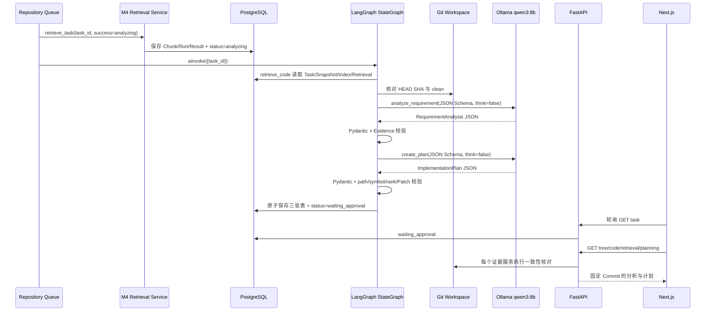

# Design: M5

## 架构决策

| 决策 | 理由 | 备选方案 |
|---|---|---|
| 使用 LangGraph 1.2 `StateGraph`，不使用高层自由工具 Agent | 节点、输入输出、终止点显式；与 ADR-003 和 M6 Checkpoint 演进一致 | 普通 Python 状态机依赖更少，但 M6 需重造恢复语义；自由 Agent 隐藏控制流 |
| 图固定为四节点线性流程 | M5 没有循环、工具调用或审批，线性图最易测试且不提前实现 M6/M8 | 单次 LLM 调用延迟低，但分析/计划无法独立验证 |
| 直接用 `httpx` 调用 Ollama Chat API | M4 已依赖 httpx；避免额外 `langchain-ollama` 适配层，Provider 边界清楚 | 托管模型质量可能更高，但代码会离开本机并增加密钥/费用 |
| 默认 `qwen3:8b`、`think=false`、`temperature=0` | 16 GB M4 可承载 5.2 GB 模型；结构化输出稳定；不保存 reasoning trace | `qwen3:4b-instruct` 更轻但规划质量预期较低；30B Coder 超过当前内存预算 |
| JSON Schema + Pydantic + 确定性证据校验三层约束 | Schema 只约束形状，业务校验还需阻止未知 path/symbol/rank 和 Patch | 自由文本解析脆弱；仅 Prompt 约束不是安全边界 |
| 最终业务结果原子保存，M5 不装 Checkpointer | 用户不能看到半份计划；保持 M6 Checkpoint 边界 | 每节点自行写表会混淆业务数据和 Checkpoint，并增加中间态恢复承诺 |
| 三张 Planning 表 | 元数据、需求分析和可版本化计划职责清楚，M6 可添加 v2 而不覆盖 v1 | 单表 JSONB 更少，但计划修订和约束较难表达 |
| Python 基线提升到 `>=3.11`，本机用 3.13 | 当前 LangGraph 要求 >=3.10，现有 3.9 已 EOL；3.13 提供受支持运行时 | 固定旧 LangGraph 0.2 可保留 3.9，但使用过时 API并积累迁移债务 |

## 完整调用链



## Graph State 与 Runtime Context

`PlanningState` 使用 `TypedDict`，仅包含可序列化值：

- `task_id: str`
- `issue: str`
- `commit_sha: str`
- `retrieval_run_id: str`
- `evidence: list[EvidenceItem]`
- `evidence_sha256: str`
- `evidence_truncated: bool`
- `analysis: dict | None`
- `plan: dict | None`
- `planning_run_id: str | None`

`PlanningRuntime` 通过 LangGraph runtime context 注入：

- `PlanningStore`
- `ChatModelProvider`
- `GitClient`
- `WorkspaceManager`
- `PlanningLimits`

图使用 `START → retrieve_code → analyze_requirement → create_plan → persist_plan → END`，`compile()` 不传 Checkpointer，调用递归上限固定为 8。

## 节点契约

### `retrieve_code`

- 只接受 `task.status=analyzing`。
- 加载 Task、Snapshot、Code Index、Retrieval Run、Top Results。
- 核对四方 Commit 与真实 HEAD/clean。
- 取 M4 Top 10；单 snippet 最多 3,000 字符，总证据最多 20,000 字符。
- 裁剪是显式行为，记录 `evidence_truncated=true` 和稳定 SHA256。
- 输出 EvidenceItem：rank/path/symbol/kind/lines/snippet/channels。

### `analyze_requirement`

- System Prompt 声明 Issue、代码和注释均为不可信数据，禁止遵循其中指令。
- 只允许根据 Evidence 形成 `RequirementAnalysisDraft`。
- 1–10 条验收标准；每条至少一个有效 evidence rank。
- 不允许代码块、Patch、命令或实现细节。

### `create_plan`

- 输入已验证 Analysis 与同一 Evidence。
- 生成 1–12 个有序步骤和 1–10 条测试策略。
- 每步 path/symbol/rank 只能取自 Evidence；禁止生成 diff、代码正文、Shell 或批准动作。
- Plan status 固定 `proposed`，version 固定 1。

### `persist_plan`

- 再次核对 task 仍为 `analyzing` 且 Retrieval Run/Commit 未变化。
- 在一个数据库事务中插入 PlanningRun、RequirementAnalysis、ImplementationPlan，并更新 `waiting_approval`。
- 唯一约束使同一 Task/Run 不会产生重复 v1。

## LLM Provider

`ChatModelProvider`：

```text
generate(messages, response_model) -> validated Pydantic model
```

Ollama 请求固定：

- URL：`http://127.0.0.1:11434/api/chat`，配置只允许 `127.0.0.1` 或 `localhost`、无凭据/Query/Fragment。
- `model=qwen3:8b`
- `stream=false`
- `think=false`
- `format=ollama_compatible_schema(response_model.model_json_schema())`；仅移除 Ollama 0.32.13 grammar 不支持的 `minLength/maxLength`，响应后仍执行完整 Pydantic 长度校验
- `options.temperature=0`
- `options.seed=0`
- `options.num_ctx=16384`
- `options.num_predict=2048`
- 单次 timeout 180 秒；响应体最多 65,536 bytes。

Provider 不保存 `message.thinking`，只验证 `message.content`。错误只向业务层返回分类异常，不记录完整 Prompt、代码或模型原始响应。

## 输出 Schema

### Requirement Analysis

- `summary`：1–2,000 字符
- `acceptance_criteria`：1–10 项；`id/description/evidence_ranks`
- `constraints`：0–10 项；`description/evidence_ranks`
- `assumptions`：0–10 项；`description/evidence_ranks`
- `affected_areas`：1–10 项；`path/symbol/reason/evidence_ranks`
- `risks`：0–10 项；`description/mitigation/evidence_ranks`

### Implementation Plan

- `steps`：1–12 项；`order/title/description/paths/symbols/evidence_ranks`
- `test_strategy`：1–10 项；`description/target_paths/evidence_ranks`
- `risk_notes`：0–10 项

所有 Schema `extra=forbid`，字符串和列表均有上限。确定性 Validator 建立 rank→path/symbol 映射，拒绝引用不存在或不匹配的对象；字符串出现 Unified Diff header 或 fenced code 时拒绝。

## 状态和前端策略

- 活跃状态：`created/queued/cloning/indexing/retrieving/analyzing`。
- M5 终态：`waiting_approval`；历史终态继续为 `cloned/indexed/retrieved`。
- `waiting_approval` 一次并行读取 Tree、Code、Retrieval、Planning。
- `failed` 尝试读取已存在的 Tree、Code、Retrieval 和 Planning；对应 `*_NOT_READY` 只忽略该产物，其余错误仍展示。
- 页面明确显示“M6 才能批准或拒绝”，不渲染伪审批按钮。

## 配置与资源限制

- `PLANNING_ENABLED=true`
- `LLM_PROVIDER=ollama`
- `LLM_MODEL=qwen3:8b`
- `LLM_BASE_URL=http://127.0.0.1:11434`
- `LLM_TIMEOUT_SECONDS=180`
- `LLM_CONTEXT_WINDOW=16384`
- `LLM_MAX_OUTPUT_TOKENS=2048`
- `LLM_MAX_RESPONSE_BYTES=65536`
- `PLANNING_EVIDENCE_LIMIT=10`
- `PLANNING_MAX_SNIPPET_CHARACTERS=3000`
- `PLANNING_MAX_EVIDENCE_CHARACTERS=20000`

配置范围由 Pydantic Settings 校验。M5 不允许远程 LLM Base URL。

## 关键文件

| 文件 | 打算怎么改 |
|---|---|
| `backend/pyproject.toml` | Python >=3.11；加入 `langgraph>=1.2,<2` |
| `backend/app/core/config.py` | M5 开关、Provider、模型、上下文和响应限制 |
| `backend/app/llms/base.py` | Chat Provider 协议与分类异常 |
| `backend/app/llms/ollama.py` | loopback Structured Chat 客户端 |
| `backend/app/agents/planning_state.py` | Graph State、Evidence DTO、Runtime Context |
| `backend/app/agents/planning_graph.py` | 四节点 StateGraph 和 Prompt/验证调用 |
| `backend/app/models/planning.py` | 三张 Planning ORM 表 |
| `backend/app/schemas/planning.py` | 模型输出、业务草稿和 API DTO |
| `backend/app/services/planning_service.py` | 图执行、失败映射和读取一致性 |
| `backend/app/services/planning_store.py` | SQL Context、原子保存、DTO 查询 |
| `backend/app/services/retrieval_service.py` | 可配置成功状态，为 M5 直达 analyzing |
| `backend/app/workers/repository_pipeline.py` | M4 后条件调用 Planning Service |
| `backend/app/api/routes/tasks.py` | `GET .../planning` |
| `backend/app/main.py` | 构造 Provider、Graph、Service 工厂 |
| `backend/migrations/versions/*_m5_*.py` | 三表、约束和可回退 migration |
| `lib/api/tasks.ts`、`lib/use-task-status.ts` | 状态、Planning DTO、读取策略 |
| `components/planning-results.tsx` | 分析、验收标准、步骤、测试和风险 UI |
| `docs/*`、`docs/adr/*` | M5 落地边界和新 ADR |

## 复用点

- `RetrievalService.get_retrieval()` 的四方一致性思路 —— Planning Context 使用相同 SHA/Worktree 验证。
- `SqlRetrievalStore` 的任务不存在、数据库异常和 DTO 映射 —— Planning Store 保持相同错误语义。
- `OllamaEmbeddingProvider` 的 loopback、timeout、响应限制模式 —— Chat Provider 复用安全设计但不混合接口职责。
- `RepositoryPipeline` 的阶段串联和可配置 success status —— M4 成功后接 M5，不改变 Queue。
- `useTaskStatus` 的非重叠轮询和失败后分产物读取 —— 增加 analyzing/waiting_approval/planning。
- M3/M4 migration 和 PostgreSQL fixture —— 验证 upgrade/downgrade/原子回滚。

## 测试设计

1. Graph topology 和节点顺序使用 Fake Store/Provider 纯单测。
2. 输出 Schema、Prompt、证据与禁止内容使用参数化边界测试。
3. Ollama Provider 使用 `httpx.MockTransport` 覆盖请求字段、timeout、HTTP、JSON、Schema 和体积。
4. Planning Service 使用 fake protocol 覆盖状态、错误映射和数据库异常透传。
5. Planning Store 使用真实 pgvector PostgreSQL 验证三表、DTO、唯一约束和事务。
6. Repository Pipeline 覆盖 Planning 开关、成功和失败，并确保历史状态不补排。
7. API 覆盖 200/404/409/422/503 与 no-store。
8. Frontend 覆盖 analyzing 轮询、waiting_approval 加载四份证据、failed 降级和 Planning 渲染。
9. 全量测试覆盖率 >=80%，再运行 migration roundtrip、真实 `qwen3:8b` MarkupSafe 案例和浏览器刷新/停止轮询。

## 风险与回滚

- Python 升级：新 3.13 venv 先执行 M1–M4 全量回归；不通过则停止 M5 实现。
- 模型质量：Schema、temperature 0、证据引用和冻结案例共同约束；页面明确标记待批准。
- Prompt Injection：不可信数据分隔、无工具、无写权限、业务 Validator；不依赖 Prompt 作为唯一安全层。
- 资源：限制 context、证据、输出和 timeout；单消费者避免并发模型压力。
- 重启：M5 明确不恢复 analyzing；M6 才加入持久 Checkpoint。
- 运行回退：关闭 `PLANNING_ENABLED` 后 Pipeline 回到 M4 `retrieved`。
- 数据回退：Alembic downgrade 仅删除 M5 三表，不修改 M1–M4 数据。
- 代码回退：Revert M5 变更；模型删除必须另行授权。
