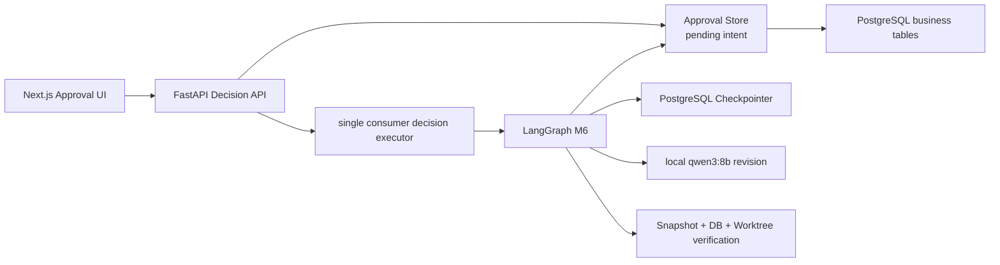

# Design: M6

> doc_version: 2
>
> spec_deltas: `[{stage: "legacy-bootstrap", reason: "LangGraph 顶层 namespace 运行时语义澄清", classification: "澄清性", at: "2026-08-17"}, {stage: "browser-acceptance", reason: "真实仓库检索重复 Chunk 与异常状态未收敛", classification: "范围性（用户已批准 mini-Gate）", at: "2026-08-17"}]`

> [SPEC-DELTA v1] 原因: LangGraph 1.2.11 的顶层 `aupdate_state` 会把非空 `checkpoint_ns` 当作子图路径；`planning-v2` 因不存在同名子图而阻断 M5 legacy bootstrap。顶层 namespace 改为空字符串，仍以 `thread_id=task UUID` 定位执行，以业务表中的 `graph_version` 校验版本。这是运行时语义澄清，不改变验收标准或影响模块。

> [SPEC-DELTA v2] 原因: M6 浏览器验收中的真实 IssuePilot 仓库触发父级类窗口与方法 Chunk 完全重合，数据库唯一键拒绝重复内容；同时广义 `SQLAlchemyError` 被误分类为数据库不可用，队列退出后 Task 仍为 `retrieving`。新增确定性去重、可恢复/不可恢复持久化错误分类和后台失败收敛，确保活跃状态对应真实执行。

## 架构决策

| 决策 | 理由 | 备选方案 |
|---|---|---|
| 使用官方 PostgreSQL LangGraph Checkpointer | 验证真实 Interrupt/Command 恢复语义，并能与多进程演进兼容 | 自建 Saver 会重写协议；SQLite 无法共享且形成第二权威文件 |
| 业务表与 Checkpoint 明确分离 | 任务、计划、决定需要稳定查询与审计；Checkpoint 只是节点执行状态 | 把业务 JSON 塞进 Checkpoint 难以查询、约束和迁移 |
| 先持久化 pending decision，再异步恢复 Graph | HTTP 返回与内存队列之间发生崩溃时仍能重放；避免假装跨事务 exactly-once | 请求内同步修订会长时间占用连接且重启丢失意图 |
| 使用幂等键、计划版本和行锁 | 解决双击、重试和并发审批，不依赖前端防抖 | 只检查前端状态存在竞态 |
| 修改只生成 Implementation Plan 新版本 | 保持 M5 Analysis 和 Issue 不变，避免一次反馈悄悄扩大需求 | 修改完整 Analysis 会改变已批准的需求输入；直接编辑复杂 JSON 用户体验差 |
| M6 只产生 approved/rejected，不进入 Patch | 审批与文件副作用分开验收，M7 才获得写入权限 | 批准后立即写代码会跨越安全 Gate |
| 应用启动只验证 Checkpoint Schema | 遵守 Alembic/显式 migration 原则，避免运行时偷偷修改数据库 | lifespan 调用 saver.setup 简单但会掩盖部署缺失 |

## 组件关系

## Graph 与恢复

新任务图版本 `planning-graph-v2`：

`retrieve_code → analyze_requirement → create_plan → persist_plan → await_approval(interrupt)`。

恢复命令根据决定路由：

- approve → `apply_approval → END`
- reject → `apply_rejection → END`
- request_changes → `revise_plan → validate_revision → persist_revision → await_approval`

`thread_id = task UUID`，顶层 `checkpoint_ns` 留空；Graph 版本由 Planning Run 元数据校验。Graph recursion limit 有界，修改次数上限 5；超过上限拒绝继续修订但保留最新计划。

恢复协调器只处理 M6 的 `analyzing/decision_pending/revising`：

1. 读取业务状态、当前计划、pending decision。
2. 读取最后 Checkpoint；核对 graph/prompt/version。
3. 重新读取 Snapshot/Index/Retrieval/Planning Run 与 Evidence hash。
4. 调用 Git 核对 Worktree HEAD 和 clean。
5. 一致才重入 Graph；否则进入 `recovery_blocked`。

M5 legacy：有 persisted plan 且无 Checkpoint时，在首次决定前以已验证 plan 初始化到 `await_approval`；没有 plan 的 `analyzing` 可在一致性通过后从 M4 evidence 重新开始。

## 事务与幂等

决定接收事务使用 `SELECT ... FOR UPDATE` 锁 Task 和当前 proposed Plan：

1. 查 `(task_id, idempotency_key)`；存在则返回原记录。
2. 要求 Task=`waiting_approval`、Plan=`proposed`、version 匹配。
3. 新增 pending decision，Task=`decision_pending`，提交。
4. 提交后入内存执行队列。

Graph 应用决定时再次锁定相同记录；只有 pending 能变 applied。崩溃后重复执行只会读取已 applied 结果。Checkpoint 与业务事务不是原子事务，pending intent 是恢复桥梁。

## Revision Prompt

输入仅包含原 Issue、不可变 Requirement Analysis、当前 Plan、用户 feedback、原 Commit 和同一组 Evidence。Prompt 禁止扩展 Issue、代码/Diff/Shell/审批动作，输出仍为 `ImplementationPlanDraft`。Validator 继续检查 rank/path/symbol、顺序和实现内容标记。

## 数据模型

`planning_decisions` 索引：唯一 `(task_id,idempotency_key)`；索引 `(status,created_at)` 用于启动恢复；FK cascade 到 task/run/plan。

`implementation_plans`：self FK `supersedes_plan_id`；同 run/version 唯一；任一 run 在应用层和带条件索引约束下最多一个 proposed 计划。

Checkpoint 内部表位于专用 schema，由 `python -m app.checkpoints.setup` 显式初始化。业务 migration 仍由 Alembic 管理。

## API 与响应

决定响应包含 `decision_id/action/status/plan_version/task_status/created_at/applied_at`。POST 始终 `Cache-Control: no-store`，新决定返回 `202`；相同幂等键也返回同一资源而不重复入库。

Planning GET 返回当前 Plan、最多 20 条按时间排序的 decision history；不暴露 Checkpoint blob、Prompt 原文或隐藏模型状态。

## 前端状态

- `waiting_approval`：停止自动轮询，显示三种操作。
- `decision_pending/revising`：禁用表单并每 3 秒轮询。
- `approved/rejected/recovery_blocked/failed`：终止轮询并显示结果或诊断。
- request_changes/reject 要求 1–2000 字原因；前端 UUID 幂等键每次用户动作只生成一次。

## 错误与降级

- `python-symbol-v2` 对相同 `path/start/end/content hash` 的父级与子级 Chunk 在调用 Embedding 前确定性去重；优先保留更具体的子级 Symbol，避免重复计算与唯一键冲突，并与不含该规则的 v1 区分。
- 数据库连接/可用性错误仍映射 `DATABASE_UNAVAILABLE`；约束冲突等持久化逻辑错误映射稳定的检索失败，并在健康 Session 中把 Task 收敛到 `failed`。
- Repository Worker 的逃逸异常不得留下假活跃状态；若数据库仍可写，使用独立 Session 和单条活跃状态条件更新收敛到 `failed`，不覆盖并发形成的终态。数据库可用性错误保存 `DATABASE_UNAVAILABLE`，其余异常保存 `REPOSITORY_PIPELINE_FAILED`；数据库仍不可写时保留日志证据。
- 409 是业务冲突，页面停止当前提交并重新读取最新计划。
- 503 保留同一个幂等键供用户重试；不得生成第二个决定。
- 修订模型失败：decision 标记 failed，Task 回到 `waiting_approval` 并保留旧 proposed 计划，同时展示失败原因。
- Checkpoint 恢复失败：Task=`recovery_blocked`，不自动猜测下一节点。
- 开关关闭：路由返回 `409 APPROVAL_WORKFLOW_DISABLED`，M5 读取链保持可用。

## 关键文件

| 文件 | 打算怎么改 |
|---|---|
| `backend/app/agents/planning_graph.py` | graph v2、Interrupt、Command 路由和 revision 节点 |
| `backend/app/agents/planning_state.py` | 决定、当前版本和 revision 状态 |
| `backend/app/checkpoints/` | pool、Saver、显式 setup 和 schema 验证 |
| `backend/app/models/planning.py` | Plan 版本关系和 PlanningDecision |
| `backend/app/schemas/planning.py` | 决定请求/响应、history 与 revision 校验 |
| `backend/app/services/planning_service.py` | submit/resume/recover/legacy bootstrap 编排 |
| `backend/app/services/planning_store.py` | 行锁、幂等事务、版本持久化和恢复查询 |
| `backend/app/workers/planning_queue.py` | 单消费者决定执行与启动重排 |
| `backend/app/main.py` | Checkpointer 生命周期、恢复和异常 handler |
| `backend/migrations/versions/*_m6_approval.py` | 业务 migration 与 downgrade |
| `components/planning-results.tsx` | 决定表单、状态、版本和历史 |
| `lib/api/tasks.ts`、`lib/use-task-status.ts` | M6 DTO、POST 和重新同步 |
| `docs/adr/010-checkpointed-approval.md` | M6 决策与替代方案 |

## 复用点

- 复用 M5 Evidence Builder、Provider、Schema、Validator 和 Planning Store 上下文核对。
- 复用 M2 Queue 的有界单消费者模式，但 pending decisions 由 PostgreSQL 持久化。
- 复用统一 `{error:{code,message,details}}` 和前端 `ApiError`。
- 复用 Task 页面四类证据展示，不复制检索或代码结构组件。

## 测试策略

- 回归：父级类的最后窗口与方法范围完全相同，只生成一个更具体的 Chunk，且 Embedding 输入无重复。
- 回归：检索约束冲突进入稳定 `failed`；Repository Worker 未分类异常不留下永久 `retrieving`。
- 单元：Graph 节点/路由、Schema、状态守卫、幂等、错误分类、轮询。
- PostgreSQL 集成：migration、行锁、版本唯一、决定重放、Saver setup 和跨 Runtime 恢复。
- 真实 Ollama：一个 request_changes 冻结案例，验证 v2 仍引用真实证据。
- 浏览器：分别完成 approve、request_changes→v2、reject；刷新恢复和控制台检查。
- 安全：审批前后 HEAD、clean、tracked file digest 一致；扫描无 Patch/Shell/测试执行入口。

## 回滚

关闭 `APPROVAL_WORKFLOW_ENABLED` 即回到 M5 只读计划；回退应用代码后保留业务与 Checkpoint 表。Alembic downgrade 只删除 M6 业务字段/表；Checkpoint Schema 默认不自动删除，防止误删恢复数据，清理必须另行批准。
