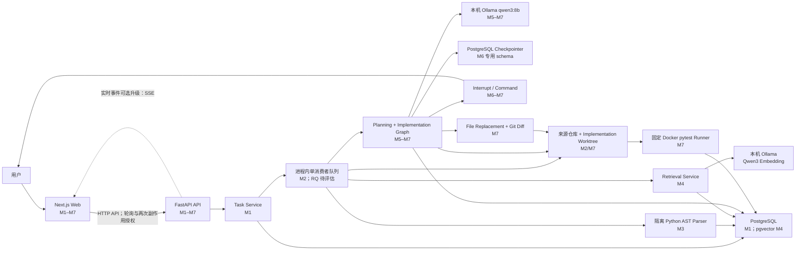
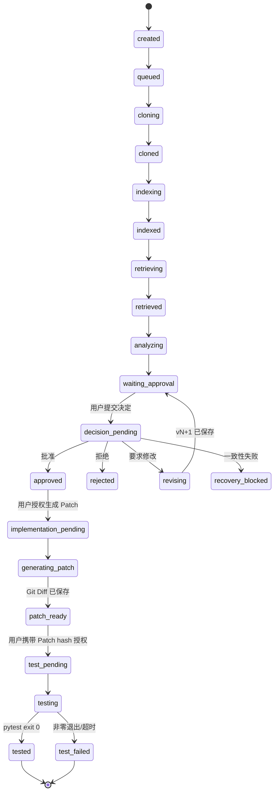

# IssuePilot 目标架构

## 文档说明

本文同时描述当前实现和 M10 之前逐步形成的目标架构。M1–M7 已验收；本地规划、Checkpoint 化人工决定、隔离 Patch 和固定容器测试已经落地。

## 组件关系



虚线 SSE 是后续升级方向。当前通过非重叠轮询读取任务；规划、Patch 与测试证据由独立 API 从 PostgreSQL 和真实工作区重新核对后返回。

## 组件职责

| 组件 | 主要职责 | 明确不负责 | 首次落地 |
|---|---|---|---|
| Next.js Web | 表单、任务列表、状态和证据展示、审批交互 | Agent 业务规则、直接访问数据库、服务端 Patch 操作 | M1 |
| FastAPI API | API 契约、Pydantic 校验、业务入口、错误响应 | 页面渲染、在 HTTP 请求内执行长任务 | M1 |
| Task Service | 创建任务、控制合法状态转换、查询任务 | UI 逻辑、直接调用浏览器 | M1 |
| PostgreSQL | 任务和事件持久化；后续保存 Checkpoint、索引元数据 | 执行工作流 | M1 |
| pgvector | 保存代码向量并支持相似度召回 | 替代业务数据库或执行重排 | M4 |
| Worker | 在请求之外执行克隆、索引和工作流 | 接收浏览器请求、绕过审批 | M2 |
| Repo Workspace | 隔离克隆与只读来源仓库；从固定 Commit 创建 Implementation Worktree | 修改来源仓库、猜测 Worktree 状态 | M2/M7 |
| Python Parser | 只读解析 tracked Python 源码并输出结构 DTO | Import/执行仓库代码、访问数据库、改变任务状态 | M3 |
| Code Index Service | 复核 Commit、调用 Parser、原子保存结构化索引 | 克隆仓库、做 M4 检索或调用模型 | M3 |
| Embedding Provider | 将文档和 Issue 转为固定维度向量；默认调用本机 Ollama | 排名、改工作区、调用 OpenAI | M4 |
| Retrieval Service | 安全 Chunk、三路召回、RRF、规则重排、原子保存检索证据 | 需求分析、生成计划、Patch 或执行代码 | M4 |
| LangGraph | 固定规划图；独立 Implementation 图、Interrupt/Command 与恢复路由 | 绕过授权、把模型文本当执行证据 | M5–M7 |
| PostgreSQL Checkpointer | 保存 LangGraph 节点状态和暂停位置 | 充当任务/计划/决定业务查询表 | M6 |
| Approval Store | 幂等决定、计划版本、审计历史和启动恢复查询 | 保存 Graph 内部 channel state | M6 |
| Implementation Store | 幂等保存 Run、Patch/Test 证据并控制合法状态转换 | 用 Checkpoint 替代业务事实、自动重试副作用 | M7 |
| Patch Service | 校验结构化完整文件替换，原子写 Implementation Worktree，再由 Git 生成规范 Diff | 执行模型提供的 Shell/Diff、修改来源仓库 | M7 |
| Docker Test Runner | 以固定镜像和 argv 执行无网络、非 root、资源受限 pytest | 安装仓库依赖、回退宿主机、接收任意命令 | M7 |
| 本机 LLM | 本机生成有证据引用的分析、计划和受限 File Replacement | 直接批准、执行命令或宣称测试通过 | M5/M7 |

## 前后端边界

Next.js 负责界面渲染和用户交互。FastAPI 负责业务规则和 API 响应；网页的视觉渲染不属于 FastAPI。前端不能直接把任务状态改为 `completed`，只能通过后端公开的动作请求合法状态转换。

选择该边界是为了让业务规则只有一个权威实现，并直接复用 Python 的 AI 与代码分析生态。

M1–M7 的具体边界如下：

- `app/` 与 `components/` 包含 App Router 页面和 Client Components；浏览器直接请求 `NEXT_PUBLIC_API_BASE_URL` 指向的 FastAPI。
- FastAPI 只允许配置中的前端 Origin，并只开放当前所需的 `GET`、`POST` 与 `Content-Type`。
- `backend/app/api` 定义 HTTP 契约，`backend/app/services` 负责事务和业务异常，`backend/app/models` 定义持久化模型。
- SQLAlchemy 使用异步 Session 和 asyncpg；数据库连接/超时失败由 Service 映射为稳定的 `503 DATABASE_UNAVAILABLE`，约束冲突等持久化逻辑错误不得伪装成基础设施不可用。
- Alembic migration 必须显式运行，应用启动不会调用 `create_all` 或隐式修改 Schema。
- Repository Queue 负责背压、单消费者调度和未分类异常回报；独立 Session 用单条条件更新只把仍处于活跃阶段的异常任务最佳努力收敛到 `failed`，不会在并发期间覆盖已形成的终态；数据库可用性错误保留 `DATABASE_UNAVAILABLE`，其余逃逸异常使用 `REPOSITORY_PIPELINE_FAILED`。
- GitClient 使用固定 argv 和隔离环境，WorkspaceManager 只接受由服务端根目录与 UUID 推导的路径。
- Code Index Service 复用 Snapshot、HEAD 和 clean 核对；Parser Client 只用固定 Python argv 和受限 JSON 协议启动子进程。
- Parser 不接收 URL 或数据库凭据，只读取父进程提供的 tracked 普通 `.py` 路径，不导入仓库模块。
- Retrieval Service 再次核对 Snapshot/Index/HEAD/clean；`python-symbol-v2` 对相同 path/行号/content hash 的父级与子级窗口在调用 Embedding 前确定性去重并保留更具体 Symbol，只把受限 Chunk 交给本机 Provider；Next.js 只显示后端排名 DTO。
- Planning Service 再次核对 Snapshot/Index/Retrieval Run/HEAD/clean；LangGraph 只接收受限 Evidence DTO，结果通过 Schema 与引用校验后才落库。
- Decision API 只接受计划版本、UUID 幂等键和三种动作；pending intent 提交后才入队。Graph 恢复再次核对业务表、Checkpoint 和 Worktree。
- Implementation API 只接受批准计划版本或预期 Patch SHA256 以及 UUID 幂等键。生成 Patch 与运行测试是两个独立动作；前端不能用一次点击跨过 Patch 审查点。
- Implementation Service 使用独立模型预算和 Checkpoint thread，只允许完整替换同时出现在实施步骤与测试目标中的既有 tracked `.py` 文件；Patch 必须由真实 Worktree 上的 Git 生成并在读取时复核 hash。
- Test Runner 只接收服务端固定 argv 和受控 Worktree 路径；Docker 镜像不可用、缺少依赖或测试失败都保存真实证据，不执行在线安装或宿主机降级。

## 任务状态模型

目标状态集合统一为：

```text
created
queued
cloning
cloned
indexing
indexed
retrieving
retrieved
analyzing
waiting_approval
decision_pending
revising
approved
rejected
recovery_blocked
implementation_pending
generating_patch
patch_ready
test_pending
testing
tested
test_failed
failed
```

主成功路径为：



M7 尚不实现 `retrying/cancelled/reviewing/completed`。不可恢复错误进入 `failed`；事实不一致或无法证明副作用结果进入 `recovery_blocked`。有限重试、Reviewer 和质量 Gate 从 M8 起另行设计。

M2 实际启用 `created → queued → cloning → cloned`，克隆或队列失败进入 `failed`。`cloned` 只表示隔离仓库已准备好，不表示整个 Issue 已完成。`tasks` 保存业务状态和失败证据，`repository_snapshots` 保存 canonical URL、Commit、计数和受限 Manifest。

M3 新任务实际启用 `cloning → indexing → indexed`：Repository Snapshot 与 `indexing` 在同一事务生效，避免浏览器观察到短暂 `cloned` 后错误停止轮询。升级前的 M2 `cloned` 保持历史终态。`indexed` 表示结构化 AST 索引已绑定固定 Commit，不表示完成检索或 Issue 分析。

M4 新任务实际从 AST 事务直接进入 `retrieving`，避免前端在短暂 `indexed` 停止轮询；Chunk 在 Embedding 前按数据库自然唯一键去重，向量、运行与排名证据原子保存后进入 `retrieved`。检索逻辑错误进入稳定 `failed`，未分类 Worker 异常也不得留下假活跃状态。升级前的 M3 `indexed` 保持历史终态。`retrieved` 只表示相关代码证据已形成，不表示完成需求分析或计划。

M5 开关开启时，M4 检索事务直接进入 `analyzing`，固定图成功后在一个事务内保存 Run、Analysis、Plan 并进入 `waiting_approval`。`waiting_approval` 是 M5 展示终态，不表示用户已经批准。历史 `retrieved` 不补排；开关关闭时仍以 `retrieved` 结束。

M6 将 `waiting_approval` 变为可操作状态。提交决定后进入 `decision_pending`；修订时进入 `revising` 并在 vN+1 落库后回到 `waiting_approval`；批准和拒绝分别进入 `approved/rejected`。任一恢复事实不一致进入 `recovery_blocked`，不猜测节点。

M7 只有收到新的幂等授权才把 `approved` 推进到 `implementation_pending/generating_patch`。Patch 持久化后停在 `patch_ready`；第二次授权形成 `test_pending/testing`，最终进入 `tested` 或 `test_failed`。`tested` 只证明固定 pytest 本次 exit code 为 0，不是 M8 质量 Gate，也不是 Commit/Push。运行中断且无法确定副作用结果时进入 `recovery_blocked`，不自动重跑测试。

## 数据所有权

- PostgreSQL 是任务状态、事件与恢复元数据的权威来源。
- Git 隔离工作区是仓库文件与本地 Patch 的权威来源。
- PostgreSQL `code_indexes/code_files/code_symbols/code_imports` 是结构化解析产物的查询来源，但必须与 Repository Snapshot 和真实工作区 Commit 核对。
- PostgreSQL `code_chunks/retrieval_runs/retrieval_results` 保存 M4 Chunk、模型/算法版本和通道排名；读取前同样复核 Snapshot、Index、Run 和真实工作区。
- PostgreSQL `planning_runs/requirement_analyses/implementation_plans` 保存 M5 模型、Prompt、证据 hash、结构化分析和 proposed v1；读取前仍进行四方一致性核对。
- PostgreSQL `planning_decisions` 和 Plan 版本关系保存 M6 用户意图与审计记录。
- PostgreSQL `implementation_runs/patch_artifacts/test_runs` 保存 M7 请求、版本、Patch/Test hash、固定 argv、镜像、退出码、耗时和受限输出。
- LangGraph Checkpoint 位于 `issuepilot_checkpoint` 专用 schema，只保存工作流节点状态，不能替代任务业务表。
- Implementation Worktree 是 M7 已写文件的权威来源；数据库 Patch hash 和 Checkpoint 都必须与其重新生成的 Git Diff 一致。
- 浏览器缓存不是权威状态；刷新页面后应从 FastAPI 重新读取。
- Tree API 返回前核对 Snapshot、任务目录、HEAD SHA 和 clean 状态；不一致时返回 `409`。

## 后台执行演进

M2 clone queue 仍是容量 20 的进程内单消费者，重启会丢失排队项。M6 decision queue 和 M7 implementation queue 同样在进程内执行，但用户 intent 先写 PostgreSQL，启动会重排安全的 pending 工作。M7 数据库写入统一按 Task → Implementation Run → Test Run 加锁。已进入 `running/testing` 却没有完成证据的测试会先清理并确认确定性容器名不存在，再进入 `recovery_blocked`，不会猜测或自动重跑。多实例共享和持久调度出现真实需求后再评估 Redis/RQ。

## 当前部署形态

本地开发运行 Next.js、FastAPI/进程内 Worker、PostgreSQL 16 + pgvector、loopback Ollama，以及按需启动的固定 Docker pytest 容器。Git 来源仓库和 Implementation Worktree 默认位于服务端控制的 `/tmp/issuepilot-workspaces`。统一编排和 Docker Compose 留到 M10。

## 安全边界

- M2 仅克隆公开 `github.com` HTTPS 仓库，拒绝凭据、端口、查询、Fragment 和重定向。
- M3 Parser 运行在独立 Python 子进程，只读 tracked 普通 `.py`，不跟随 symlink、不加载 Submodule、不 Import 或执行源码。
- M3 限制 Python 文件数、单文件/总字节、结构条目与解析时间；子进程错误只返回受限摘要。
- M4 只读取 hash 未变化的 tracked Python 普通文件，限制 Chunk 数、行数、字符数和 Embedding 批次；`truncate=false` 防止静默截断，响应必须是 1024 维有限数。
- M4 默认只向 loopback Ollama 发送公开仓库 Chunk，不调用 OpenAI 或其他外部 Embedding API。
- M5 Chat Provider 同样只接受 loopback HTTP，无工具和文件写权限；Issue、代码和注释均作为不可信数据，Prompt 之外再用确定性 Validator 拒绝伪造 path/symbol/rank、代码块和 Diff。
- M6 修订继续使用相同 loopback Provider 和原 Evidence；批准/拒绝不调用模型。Checkpoint 与业务表不一致时停止为 `recovery_blocked`。
- M7 实现模型仍只允许 loopback Ollama，但使用独立 32K context、16K 输出 token 和 256 KiB 响应上限；较大完整文件替换仍可能慢或失败，这是 M7 已知限制。
- M7 只替换实施步骤路径与测试目标路径交集中的现存 tracked UTF-8 `.py` 文件；拒绝新建/删除/重命名、symlink、submodule、mode/binary 变化、路径穿越、原 hash 不符和资源超限。
- Patch 必须由 Git 从隔离 Worktree 生成；模型不能直接提供可执行 Diff 或命令。Patch hash 不符时拒绝运行测试。
- pytest 运行在固定镜像 digest、无网络、非 root、只读 Worktree mount、cap-drop/no-new-privileges 和 CPU/内存/PID/双层超时/输出限制下；只接受本机 Unix Docker socket。Runner 不安装依赖且绝不回退宿主机，完整输出在截断展示文本之外增量计算 hash。
- 所有仓库操作在受控临时目录或 Worktree 中执行。
- Git 通过参数数组运行，关闭凭据交互和系统/全局配置；浅克隆且不初始化 Submodule/LFS。
- 每次克隆限制为 60 秒、100 MiB、5,000 tracked entries 和 25 层目录；这些值只能由服务端配置。
- MVP 只允许 `pytest` 白名单命令族，不将用户输入拼接成 Shell 命令。
- M6 计划批准后仍需单独授权生成 Patch；Patch 审查后还需再次授权测试。
- MVP 不 Commit、不 Push、不创建真实 PR。
- 失败后保存证据和最后成功节点，不通过无限重试扩大修改范围。
