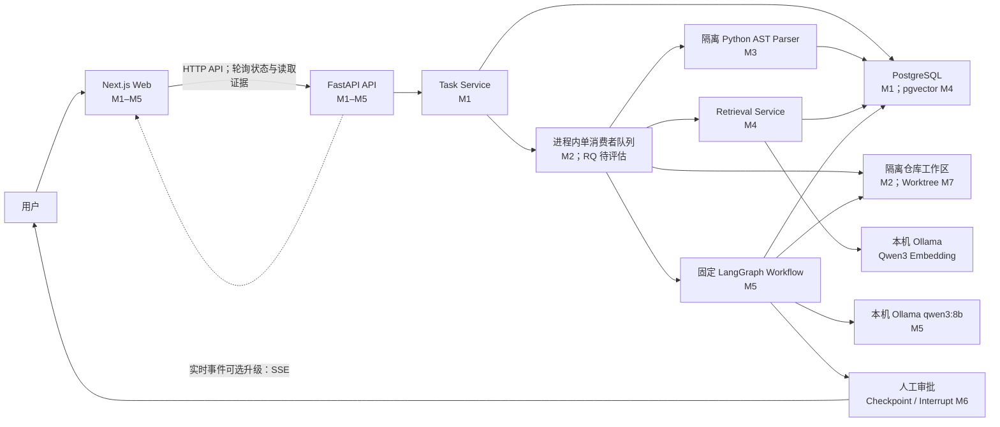
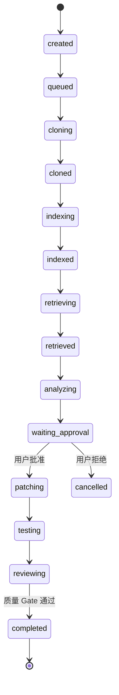

# IssuePilot 目标架构

## 文档说明

本文同时描述当前实现和 M10 之前逐步形成的目标架构。M1–M5 已验收；本地 Embedding、pgvector 混合检索、固定 LangGraph 规划和计划页已经落地。审批、恢复和 Patch 仍是后续目标。

## 组件关系



虚线 SSE 是后续升级方向。当前通过非重叠轮询读取状态，终态再分别读取 Tree、Code Structure 和 Retrieval API。

## 组件职责

| 组件 | 主要职责 | 明确不负责 | 首次落地 |
|---|---|---|---|
| Next.js Web | 表单、任务列表、状态和证据展示、审批交互 | Agent 业务规则、直接访问数据库、服务端 Patch 操作 | M1 |
| FastAPI API | API 契约、Pydantic 校验、业务入口、错误响应 | 页面渲染、在 HTTP 请求内执行长任务 | M1 |
| Task Service | 创建任务、控制合法状态转换、查询任务 | UI 逻辑、直接调用浏览器 | M1 |
| PostgreSQL | 任务和事件持久化；后续保存 Checkpoint、索引元数据 | 执行工作流 | M1 |
| pgvector | 保存代码向量并支持相似度召回 | 替代业务数据库或执行重排 | M4 |
| Worker | 在请求之外执行克隆、索引和工作流 | 接收浏览器请求、绕过审批 | M2 |
| Repo Workspace | 隔离克隆、文件读取；后续创建 Worktree、应用 Patch、执行测试 | 修改用户原仓库 | M2/M7 |
| Python Parser | 只读解析 tracked Python 源码并输出结构 DTO | Import/执行仓库代码、访问数据库、改变任务状态 | M3 |
| Code Index Service | 复核 Commit、调用 Parser、原子保存结构化索引 | 克隆仓库、做 M4 检索或调用模型 | M3 |
| Embedding Provider | 将文档和 Issue 转为固定维度向量；默认调用本机 Ollama | 排名、改工作区、调用 OpenAI | M4 |
| Retrieval Service | 安全 Chunk、三路召回、RRF、规则重排、原子保存检索证据 | 需求分析、生成计划、Patch 或执行代码 | M4 |
| LangGraph | M5 固定四节点规划；M6 再增加 Checkpoint/Interrupt | 绕过工具权限、决定是否批准高风险动作 | M5/M6 |
| 单一 LLM | 本机生成有证据引用的需求分析和实施计划 | 直接批准、写文件、执行命令或宣称测试通过 | M5 |

## 前后端边界

Next.js 负责界面渲染和用户交互。FastAPI 负责业务规则和 API 响应；网页的视觉渲染不属于 FastAPI。前端不能直接把任务状态改为 `completed`，只能通过后端公开的动作请求合法状态转换。

选择该边界是为了让业务规则只有一个权威实现，并直接复用 Python 的 AI 与代码分析生态。

M1–M5 的具体边界如下：

- `app/` 与 `components/` 包含 App Router 页面和 Client Components；浏览器直接请求 `NEXT_PUBLIC_API_BASE_URL` 指向的 FastAPI。
- FastAPI 只允许配置中的前端 Origin，并只开放当前所需的 `GET`、`POST` 与 `Content-Type`。
- `backend/app/api` 定义 HTTP 契约，`backend/app/services` 负责事务和业务异常，`backend/app/models` 定义持久化模型。
- SQLAlchemy 使用异步 Session 和 asyncpg；数据库连接失败由 Service 映射为稳定的 `503 DATABASE_UNAVAILABLE`。
- Alembic migration 必须显式运行，应用启动不会调用 `create_all` 或隐式修改 Schema。
- Repository Queue 只负责背压与单消费者调度；Repository Service 编排 Git 与数据库，GitClient 不修改业务状态。
- GitClient 使用固定 argv 和隔离环境，WorkspaceManager 只接受由服务端根目录与 UUID 推导的路径。
- Code Index Service 复用 Snapshot、HEAD 和 clean 核对；Parser Client 只用固定 Python argv 和受限 JSON 协议启动子进程。
- Parser 不接收 URL 或数据库凭据，只读取父进程提供的 tracked 普通 `.py` 路径，不导入仓库模块。
- Retrieval Service 再次核对 Snapshot/Index/HEAD/clean，只把受限 Chunk 交给本机 Provider；Next.js 只显示后端排名 DTO。
- Planning Service 再次核对 Snapshot/Index/Retrieval Run/HEAD/clean；LangGraph 只接收受限 Evidence DTO，结果通过 Schema 与引用校验后才落库。

## 任务状态模型

目标状态集合统一为：

```text
created
queued
cloning
cloned
indexing
indexed
retrieving
retrieved
analyzing
waiting_approval
patching
testing
reviewing
completed
retrying
failed
cancelled
```

主成功路径为：



执行状态可因可恢复错误进入 `retrying`，再回到原阶段；超过重试上限进入 `failed`。用户主动终止进入 `cancelled`。后续里程碑再逐步启用尚未落地的转换。

M2 实际启用 `created → queued → cloning → cloned`，克隆或队列失败进入 `failed`。`cloned` 只表示隔离仓库已准备好，不表示整个 Issue 已完成。`tasks` 保存业务状态和失败证据，`repository_snapshots` 保存 canonical URL、Commit、计数和受限 Manifest。

M3 新任务实际启用 `cloning → indexing → indexed`：Repository Snapshot 与 `indexing` 在同一事务生效，避免浏览器观察到短暂 `cloned` 后错误停止轮询。升级前的 M2 `cloned` 保持历史终态。`indexed` 表示结构化 AST 索引已绑定固定 Commit，不表示完成检索或 Issue 分析。

M4 新任务实际从 AST 事务直接进入 `retrieving`，避免前端在短暂 `indexed` 停止轮询；Chunk、向量、运行与排名证据原子保存后进入 `retrieved`。升级前的 M3 `indexed` 保持历史终态。`retrieved` 只表示相关代码证据已形成，不表示完成需求分析或计划。

M5 开关开启时，M4 检索事务直接进入 `analyzing`，固定图成功后在一个事务内保存 Run、Analysis、Plan 并进入 `waiting_approval`。`waiting_approval` 是 M5 展示终态，不表示用户已经批准。历史 `retrieved` 不补排；开关关闭时仍以 `retrieved` 结束。

## 数据所有权

- PostgreSQL 是任务状态、事件与恢复元数据的权威来源。
- Git 隔离工作区是仓库文件与本地 Patch 的权威来源。
- PostgreSQL `code_indexes/code_files/code_symbols/code_imports` 是结构化解析产物的查询来源，但必须与 Repository Snapshot 和真实工作区 Commit 核对。
- PostgreSQL `code_chunks/retrieval_runs/retrieval_results` 保存 M4 Chunk、模型/算法版本和通道排名；读取前同样复核 Snapshot、Index、Run 和真实工作区。
- PostgreSQL `planning_runs/requirement_analyses/implementation_plans` 保存 M5 模型、Prompt、证据 hash、结构化分析和 proposed v1；读取前仍进行四方一致性核对。
- LangGraph Checkpoint 保存工作流节点状态，但不能替代任务业务表。
- 浏览器缓存不是权威状态；刷新页面后应从 FastAPI 重新读取。
- Tree API 返回前核对 Snapshot、任务目录、HEAD SHA 和 clean 状态；不一致时返回 `409`。

## 后台执行演进

M2 使用容量 20、单消费者的进程内 `asyncio.Queue`。它能控制并发，但服务重启会丢失待处理任务，也不支持多实例；该限制是评估 Redis + RQ 或其他持久队列的真实依据。Celery 和 Temporal 保留为替代方案，不预先引入。

## 当前部署形态

本地开发运行四个独立进程/服务：浏览器访问 `localhost:3000` 的 Next.js，FastAPI 监听 `localhost:8000` 并托管进程内 Worker，PostgreSQL 16 + pgvector 保存业务与向量，Ollama 在 loopback `11434` 同时提供 Embedding 和 `qwen3:8b` Chat。Git 工作区默认位于 `/tmp/issuepilot-workspaces`。统一编排和 Docker Compose 留到 M10。

## 安全边界

- M2 仅克隆公开 `github.com` HTTPS 仓库，拒绝凭据、端口、查询、Fragment 和重定向。
- M3 Parser 运行在独立 Python 子进程，只读 tracked 普通 `.py`，不跟随 symlink、不加载 Submodule、不 Import 或执行源码。
- M3 限制 Python 文件数、单文件/总字节、结构条目与解析时间；子进程错误只返回受限摘要。
- M4 只读取 hash 未变化的 tracked Python 普通文件，限制 Chunk 数、行数、字符数和 Embedding 批次；`truncate=false` 防止静默截断，响应必须是 1024 维有限数。
- M4 默认只向 loopback Ollama 发送公开仓库 Chunk，不调用 OpenAI 或其他外部 Embedding API。
- M5 Chat Provider 同样只接受 loopback HTTP，无工具和文件写权限；Issue、代码和注释均作为不可信数据，Prompt 之外再用确定性 Validator 拒绝伪造 path/symbol/rank、代码块和 Diff。
- 所有仓库操作在受控临时目录或 Worktree 中执行。
- Git 通过参数数组运行，关闭凭据交互和系统/全局配置；浅克隆且不初始化 Submodule/LFS。
- 每次克隆限制为 60 秒、100 MiB、5,000 tracked entries 和 25 层目录；这些值只能由服务端配置。
- MVP 只允许 `pytest` 白名单命令族，不将用户输入拼接成 Shell 命令。
- Patch 在人工批准后才能应用。
- MVP 不 Commit、不 Push、不创建真实 PR。
- 失败后保存证据和最后成功节点，不通过无限重试扩大修改范围。
