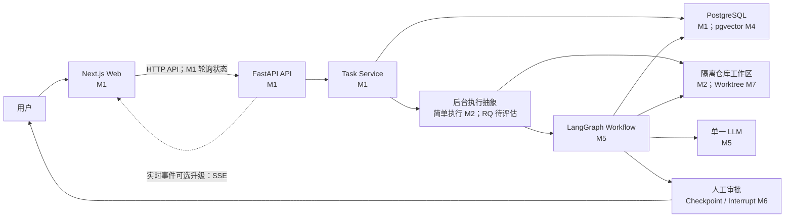
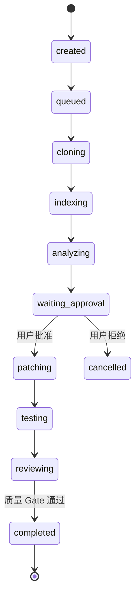

# IssuePilot 目标架构

## 文档说明

本文同时描述当前实现和 M10 之前逐步形成的目标架构。M1 的 Next.js、FastAPI、Task Service、PostgreSQL 与轮询链已经实现并通过产品验收；Worker、仓库工作区、LangGraph 等仍是后续目标。每项能力的首次落地里程碑见下文。

## 组件关系



虚线 SSE 是后续升级方向，不属于 M1。M1 通过轮询完成任务状态读取。

## 组件职责

| 组件 | 主要职责 | 明确不负责 | 首次落地 |
|---|---|---|---|
| Next.js Web | 表单、任务列表、状态和证据展示、审批交互 | Agent 业务规则、直接访问数据库、服务端 Patch 操作 | M1 |
| FastAPI API | API 契约、Pydantic 校验、业务入口、错误响应 | 页面渲染、在 HTTP 请求内执行长任务 | M1 |
| Task Service | 创建任务、控制合法状态转换、查询任务 | UI 逻辑、直接调用浏览器 | M1 |
| PostgreSQL | 任务和事件持久化；后续保存 Checkpoint、索引元数据 | 执行工作流 | M1 |
| pgvector | 保存代码向量并支持相似度召回 | 替代业务数据库或执行重排 | M4 |
| Worker | 在请求之外执行克隆、索引和工作流 | 接收浏览器请求、绕过审批 | M2 |
| Repo Workspace | 隔离克隆、文件读取；后续创建 Worktree、应用 Patch、执行测试 | 修改用户原仓库 | M2/M7 |
| LangGraph | 显式节点、状态、分支、Checkpoint、Interrupt、有限循环 | 绕过工具权限、决定是否批准高风险动作 | M5/M6 |
| 单一 LLM | 需求分析、规划、Patch 建议和审查建议 | 直接批准高风险操作、宣称未执行的测试通过 | M5 |

## 前后端边界

Next.js 负责界面渲染和用户交互。FastAPI 负责业务规则和 API 响应；网页的视觉渲染不属于 FastAPI。前端不能直接把任务状态改为 `completed`，只能通过后端公开的动作请求合法状态转换。

选择该边界是为了让业务规则只有一个权威实现，并直接复用 Python 的 AI 与代码分析生态。

M1 的具体边界如下：

- `app/` 与 `components/` 包含 App Router 页面和 Client Components；浏览器直接请求 `NEXT_PUBLIC_API_BASE_URL` 指向的 FastAPI。
- FastAPI 只允许配置中的前端 Origin，并只开放 M1 所需的 `GET`、`POST` 与 `Content-Type`。
- `backend/app/api` 定义 HTTP 契约，`backend/app/services` 负责事务和业务异常，`backend/app/models` 定义持久化模型。
- SQLAlchemy 使用异步 Session 和 asyncpg；数据库连接失败由 Service 映射为稳定的 `503 DATABASE_UNAVAILABLE`。
- Alembic migration 必须显式运行，应用启动不会调用 `create_all` 或隐式修改 Schema。

## 任务状态模型

目标状态集合统一为：

```text
created
queued
cloning
indexing
analyzing
waiting_approval
patching
testing
reviewing
completed
retrying
failed
cancelled
```

主成功路径为：



执行状态可因可恢复错误进入 `retrying`，再回到原阶段；超过重试上限进入 `failed`。用户主动终止进入 `cancelled`。M1 只需要实现创建、持久化和查询所需的最小状态子集，后续里程碑再逐步启用其余转换。

M1 实际只启用 `created`，且没有状态转换入口。`tasks` 表字段为：UUID 主键 `id`、`repository_url`、`issue_text`、`status`、带时区的 `created_at` 与 `updated_at`。API DTO 对外使用 `task_id` 和 `issue`，避免把数据库列名直接变成永久外部契约。

## 数据所有权

- PostgreSQL 是任务状态、事件与恢复元数据的权威来源。
- Git 隔离工作区是仓库文件与本地 Patch 的权威来源。
- LangGraph Checkpoint 保存工作流节点状态，但不能替代任务业务表。
- 浏览器缓存不是权威状态；刷新页面后应从 FastAPI 重新读取。

## 后台执行演进

M1 只创建并保存任务，不启动耗时工作流。M2 可先使用简单后台执行验证克隆调用链。Redis 本身不是任务系统；只有在观察到排队、重启恢复或并发隔离的真实需要后，才评估 Redis + RQ。Celery 和 Temporal 均保留为替代方案，不在当前目标中预先引入。

## M1 部署形态

本地开发运行三个独立进程/服务：浏览器访问 `localhost:3000` 的 Next.js，FastAPI 监听 `localhost:8000`，PostgreSQL 16 容器映射到 `localhost:54329`。这只是 M1 的开发拓扑；统一编排和 Docker Compose 留到 M10。

## 安全边界

- 仅克隆公开 HTTPS 仓库，并进行 URL 与体积限制校验。
- 所有仓库操作在受控临时目录或 Worktree 中执行。
- MVP 只允许 `pytest` 白名单命令族，不将用户输入拼接成 Shell 命令。
- Patch 在人工批准后才能应用。
- MVP 不 Commit、不 Push、不创建真实 PR。
- 失败后保存证据和最后成功节点，不通过无限重试扩大修改范围。
