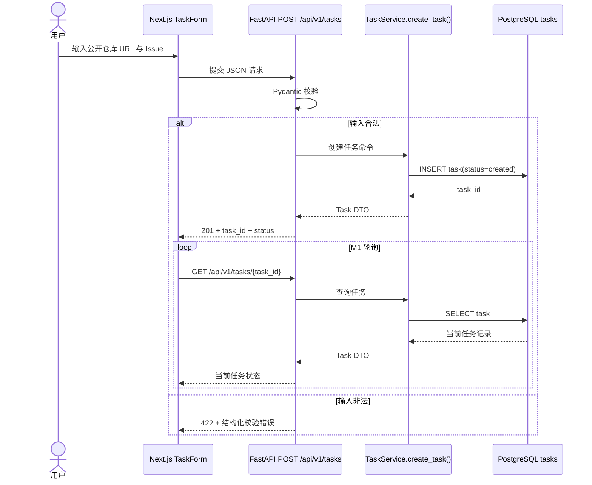
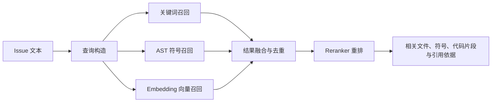
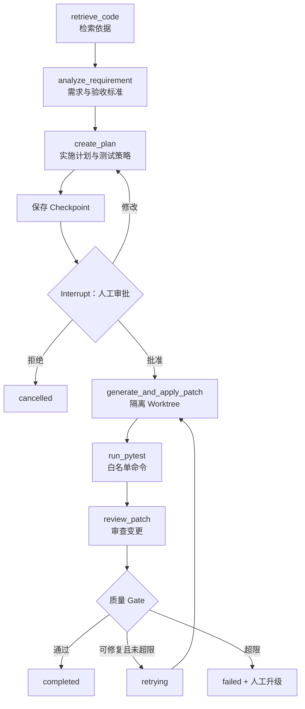
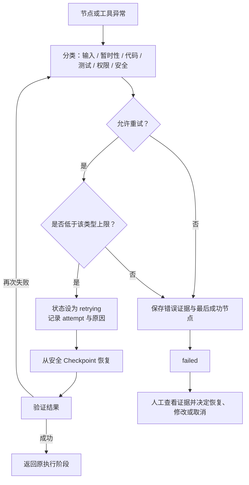

# IssuePilot 调用链

## 文档说明

以下是调用链及其逐步落地计划。请求链已在 M1 实现并通过产品验收；检索、Agent、恢复等能力仍在后续里程碑引入。

## 1. 请求链

首次落地：M1。

输入是仓库 URL 和 Issue；输出是可持久化查询的 `task_id`、状态和错误契约。M1 不克隆仓库，也不启动 Agent。后续若加入 SSE，仍由 FastAPI 推送事件，数据库继续作为权威状态来源。

### M1 已实现契约

1. 首页 Client Component 将 `{ repository_url, issue }` 发送到 `POST /api/v1/tasks`。
2. Pydantic 拒绝额外字段、非 HTTPS/无主机/带凭据的 URL、空 Issue 和超长输入；合法 URL 不在 M1 发起网络访问。
3. Task Service 开启异步数据库事务并插入 `status=created` 的记录；成功返回 `201`、`Location` 和任务 DTO。
4. 前端导航到 `/tasks/{task_id}`，立即请求 `GET /api/v1/tasks/{task_id}`，之后在前一次请求结束 3 秒后再调度下一次，避免重叠请求。
5. 每次查询都由 FastAPI 重新读取 PostgreSQL，并返回 `Cache-Control: no-store`；页面刷新不依赖浏览器缓存恢复状态。

错误统一为 `{ error: { code, message, details } }`：字段或路径参数不合法返回 `422`，任务不存在返回 `404`，数据库连接/事务不可用返回 `503`，未分类异常返回 `500`。详情页遇到 `4xx` 会展示错误并停止轮询；网络错误或 `5xx` 会展示错误并继续有限频率轮询，以便服务恢复后自动重新同步。

## 2. 检索链

结构化代码首次落地：M3；完整混合检索首次落地：M4。

正常输出必须带文件路径、符号与来源，不能只返回模型总结。若召回不足，系统可在限定次数内扩大查询或 Top-K；仍不足则保存检索证据并进入 `failed` 或人工处理，而不是臆造代码上下文。

## 3. Agent 链

分析与规划首次落地：M5；审批与恢复首次落地：M6；Patch 和测试首次落地：M7；审查修复环首次落地：M8。

LangGraph 节点不是让多个角色自由聊天，而是让每一步的输入、输出和下一步显式可见。审批节点通过 Interrupt 暂停；用户决定后从 Checkpoint 恢复。

## 4. 失败链

基本错误契约从 M1 开始；跨节点 Checkpoint 恢复在 M6 落地；有限修复循环在 M8 落地。

恢复不是还原模型当时的思考，而是读取持久化状态、文件、事件与最后成功节点，再安全地继续。对可能产生副作用的步骤，恢复前必须检查幂等性并在需要时再次请求批准。

## 状态与证据约定

每次状态变化至少记录：

- `task_id`
- 原状态与新状态
- 当前节点或阶段
- 事件时间
- 尝试次数
- 错误类型与摘要（如有）
- 最后成功节点（如有）
- 测试命令、退出码与输出摘要（测试阶段）

页面展示的“成功”必须来自已持久化的执行证据，不能只来自 LLM 文本。
