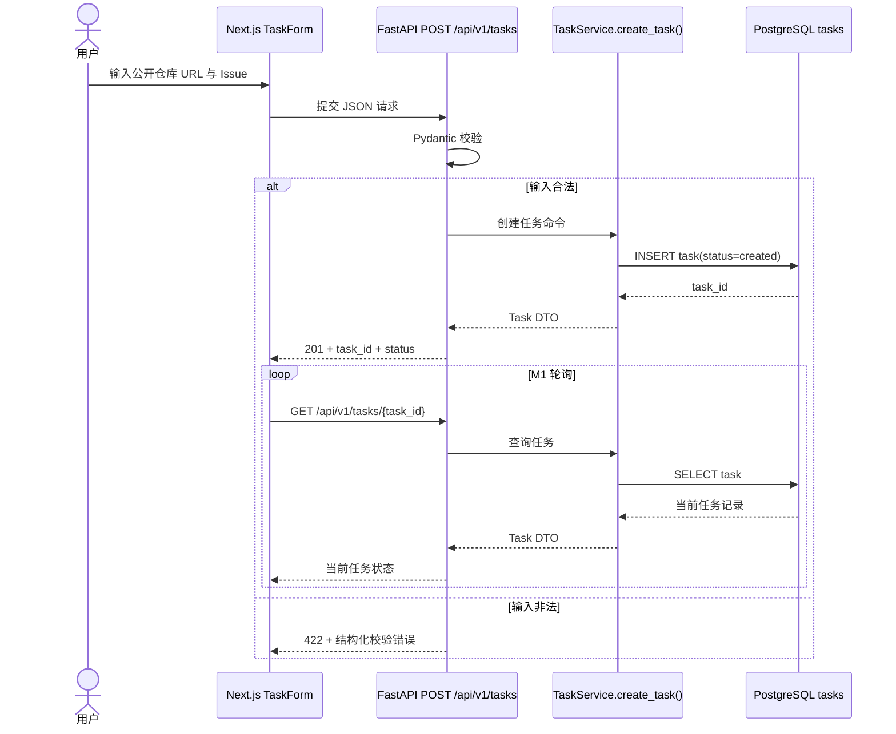
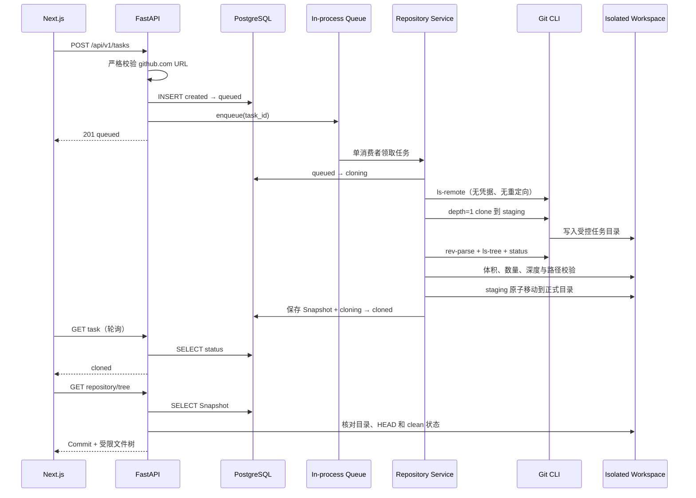
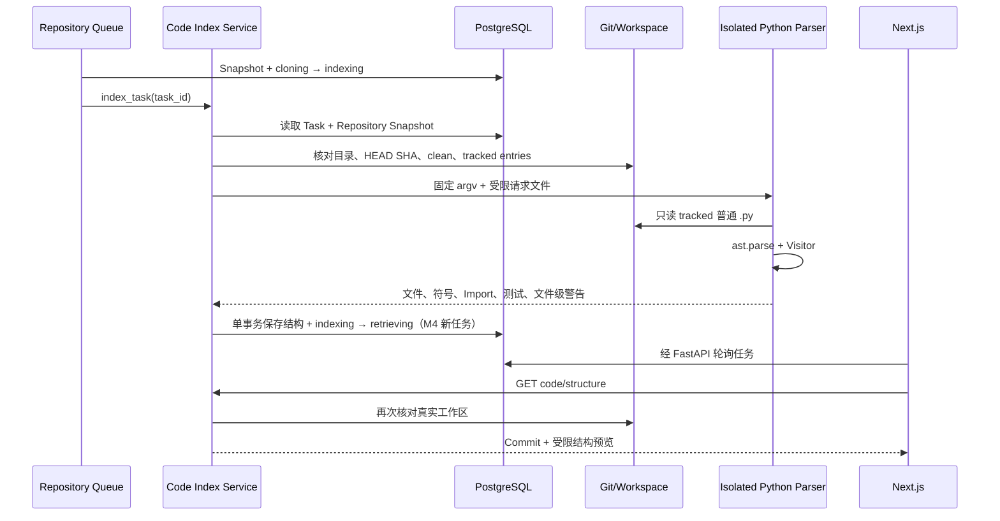
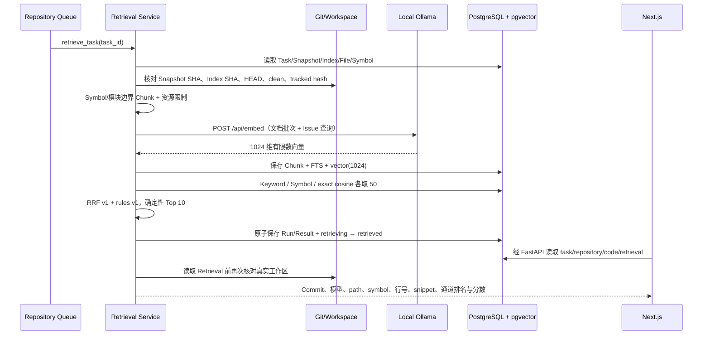
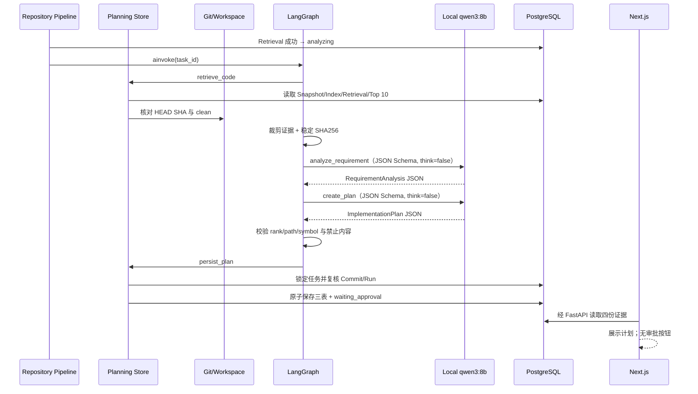
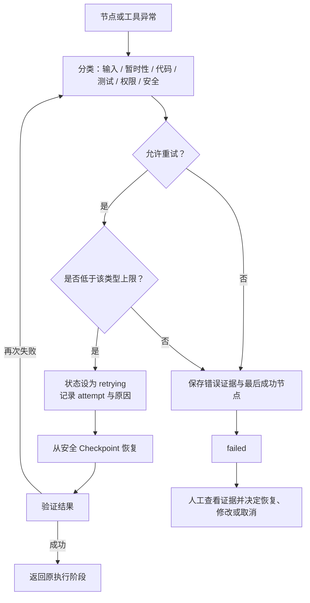

# IssuePilot 调用链

## 文档说明

以下是调用链及其逐步落地计划。M1–M5 已验收。审批恢复和 Patch 仍在后续里程碑引入。

## 1. 请求链

首次落地：M1。

输入是仓库 URL 和 Issue；输出是可持久化查询的 `task_id`、状态和错误契约。M1 不克隆仓库，也不启动 Agent。后续若加入 SSE，仍由 FastAPI 推送事件，数据库继续作为权威状态来源。

### M1 已实现契约

1. 首页 Client Component 将 `{ repository_url, issue }` 发送到 `POST /api/v1/tasks`。
2. Pydantic 拒绝额外字段、非 HTTPS/无主机/带凭据的 URL、空 Issue 和超长输入；合法 URL 不在 M1 发起网络访问。
3. Task Service 开启异步数据库事务并插入 `status=created` 的记录；成功返回 `201`、`Location` 和任务 DTO。
4. 前端导航到 `/tasks/{task_id}`，立即请求 `GET /api/v1/tasks/{task_id}`，之后在前一次请求结束 3 秒后再调度下一次，避免重叠请求。
5. 每次查询都由 FastAPI 重新读取 PostgreSQL，并返回 `Cache-Control: no-store`；页面刷新不依赖浏览器缓存恢复状态。

错误统一为 `{ error: { code, message, details } }`：字段或路径参数不合法返回 `422`，任务不存在返回 `404`，数据库连接/事务不可用返回 `503`，未分类异常返回 `500`。详情页遇到 `4xx` 会展示错误并停止轮询；网络错误或 `5xx` 会展示错误并继续有限频率轮询，以便服务恢复后自动重新同步。

## 2. 仓库获取链

首次落地：M2。

M2 把“请求错误”和“任务业务失败”分开：不安全 URL 在任何 Git 调用前返回 `422` 且不建任务；远程仓库不存在、私有、超时或超限时，任务本身已经存在，因此 GET Task 返回 `200 + status=failed + failure`。数据库/工作区/SHA 不一致时 Tree API 返回 `409 WORKSPACE_INCONSISTENT`，不会用数据库 Manifest 掩盖真实文件缺失。

页面在 `created/queued/cloning` 继续非重叠轮询，在 `cloned/failed` 停止；`cloned` 只读取一次 Tree API。Tree API 的网络错误或 `5xx` 可继续低频重试，永久 `4xx` 停止。

## 3. Python 结构化链

首次落地：M3。

M3 历史任务在 `indexed/failed` 停止；M4 新任务由索引事务直接进入 `retrieving`。历史 M2 `cloned` 和 M3 `indexed` 仍是终态。解析错误分两级：单文件编码/语法问题作为索引警告；没有可解析 Python、超时、超限、Parser 协议错误或工作区不一致使任务进入 `failed`。任何情况下都不 Import 或执行仓库代码。

## 4. 检索链

结构化代码首次落地：M3；完整混合检索首次落地：M4。

M4 新任务在 `retrieving` 继续轮询，在 `retrieved/failed` 停止；历史 `cloned/indexed` 保持终态且不自动补排。正常输出必须带固定 Commit、文件路径、符号、行号、代码片段和每路排名，不能只返回模型总结。Embedding 不可用、响应非法或资源超限会保存稳定失败码；已形成的 Tree 和 Code Structure 仍可读取。

## 5. 本地规划链

分析与规划首次落地：M5。

M5 图固定为 `START → retrieve_code → analyze_requirement → create_plan → persist_plan → END`，不包含 Checkpoint、Interrupt、工具、循环或文件写入。模型失败、输出非法、证据越界或工作区不一致会保存稳定 failure code；数据库不可用仍返回基础设施错误。`waiting_approval` 只是业务状态和页面提示。

M6 才在 Planning 之后加入持久 Checkpoint 与 Interrupt，接收批准、修改或拒绝并在恢复前同时核对 Checkpoint、PostgreSQL 与真实 Worktree。M7 再引入 Worktree、Patch 和白名单测试，M8 才加入 Reviewer 与有限修复环。

## 6. 失败链

基本错误契约从 M1 开始；跨节点 Checkpoint 恢复在 M6 落地；有限修复循环在 M8 落地。

恢复不是还原模型当时的思考，而是读取持久化状态、文件、事件与最后成功节点，再安全地继续。对可能产生副作用的步骤，恢复前必须检查幂等性并在需要时再次请求批准。

## 状态与证据约定

每次状态变化至少记录：

- `task_id`
- 原状态与新状态
- 当前节点或阶段
- 事件时间
- 尝试次数
- 错误类型与摘要（如有）
- 最后成功节点（如有）
- 测试命令、退出码与输出摘要（测试阶段）

页面展示的“成功”必须来自已持久化的执行证据，不能只来自 LLM 文本。
